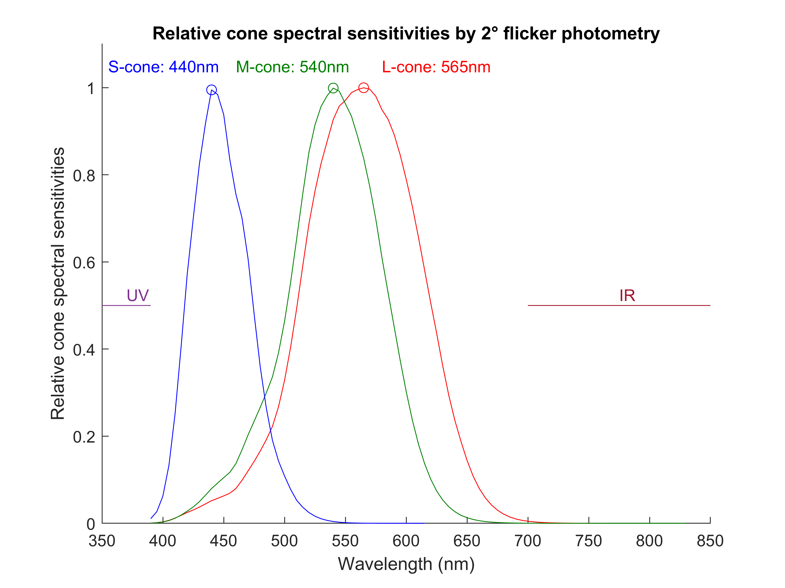

# Visual Stimulation

## Fundamentals

### Terminology

**Radiant power** 
Defined by the Planck-Einstein relation. 
$E = hf = \cfrac{hc}{\lambda}$ 
$1\ Watt = \lambda_{nm} \times 5.034 \times 10^{15} \ photons \ per \ second$

**Lumen** 
Luminous energy emitted by an isotropic point light source.

**Candela** 
Lumen subjective to human perception. Candele under photopic setup with frequency of ***human photopic spectral sensitivity maxima*** and  ***human scotopic spectral sensitivity maxima*** defined to be $683lm$ and $1700lm$ respectively.

**Luminance** 
Luminous energy per surface area with unit of Candela per square metre $(Cd\ m^{-2})$.

**Illuminance** 
Luminous energy received by specific surface area with unit of Lumen per square metre $(lm\ m^{-2})$ or $(lux)$.

**Steridian** 
Solid angle with unit of steridian $(Sr)$. Defined by sphere surface area devided by sphere radius: The complete solid angle is $4\pi$.

**Troland** 
Candela per pupillary area ($Cd\ mm^{-2}$) with unit of troland $(Td)$. Describe the estimation of luminous energy received by the retinal surface.

**Human scotopic spectral sensitivity maxima** 
Light with frequency of $507nm$ for the maximum absorption in human retina under scotopic setup.  
1 watt of radiant power equals to 1700 lumen at this wavelength.

**Human photopic spectral sensitivity maxima** 
Light with frequency of $555nm$ for the maximum absorption in human retina under photopic setup. 
1 watt of radiant power equals to 683 lumen at this wavelength.

## Cone spectral absorbance

### Psychophysics 

Psychophysic response is estimated by subjective flicker photometry.

 

Produced from dataset reported by A Stockman and LT Sharpe (2000). The relative cone spectral sensitivities are measured by 2° flicker photometry.

### Prereceptoral spectral absorbance

**Lens** 
Spectral absorbance reduced against rising wavelength. The reduction will be more signficant with lens yellowing from aging.

**Macular yellow pigment** 
$\lambda_{max} \, 460nm$

### Receptoral spectral absorbance

**L-cone** 
$\lambda_{max} \, 559nm$

**M-cone** 
$\lambda_{max} \, 530nm$

**S-cone** 
$\lambda_{max} \, 421nm$

## Ganzfeld stimulation

## Pattern stimulation

## Calibration

## Reference

- Chromatic Function of the Cones. DH Foster, et al. (2017) DOI: 10.1016/B978-0-12-374203-2.00232-3.
- Essentials of photometry for clinical electrophysiology
of vision. DL McCulloch, R Hamilton. (2010) DOI: 10.1007/s10633-010-9233-2